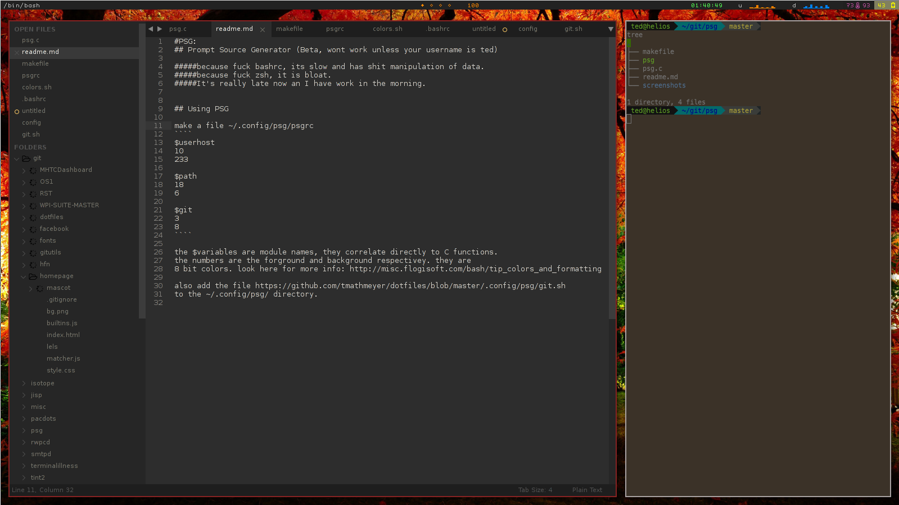
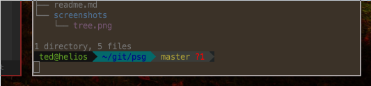
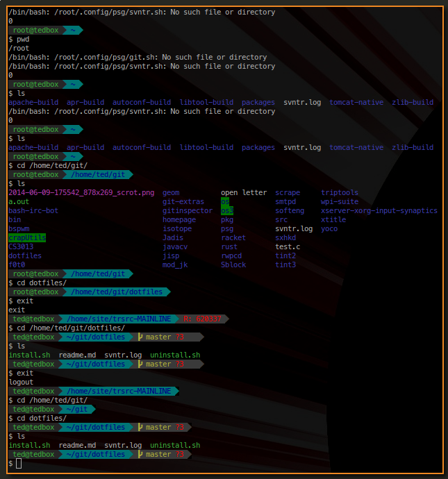

#PSG:
## Prompt Source Generator (Beta, wont work unless your username is ted)

#####because bash has trash control over stuctured data
#####because zsh is hipster and bloat


## Using PSG

make a file ~/.config/psg/psgrc
````
$userhost
10
233

$path
18
6

$git
3
8
````

the $variables are module names, they correlate directly to C functions.
the numbers are the forground and background respectivey. they are
8 bit colors. look here for more info: http://misc.flogisoft.com/bash/tip_colors_and_formatting

also add the file https://github.com/tmathmeyer/dotfiles/blob/master/.config/psg/git.sh
to the ~/.config/psg/ directory. 


##SCREENSHOTS




